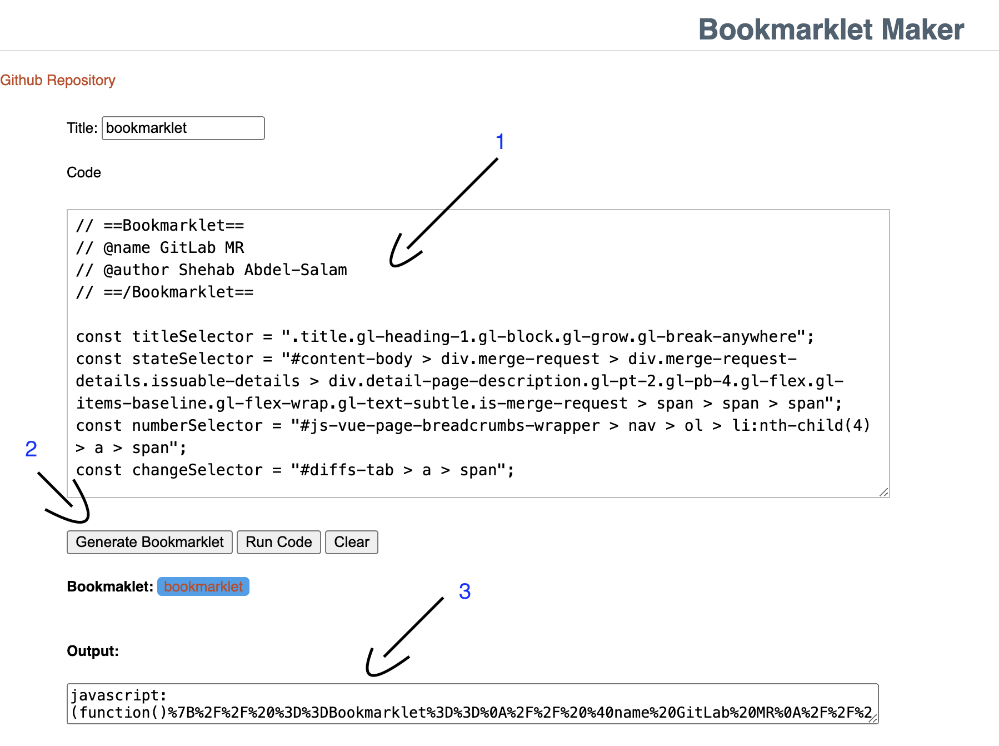
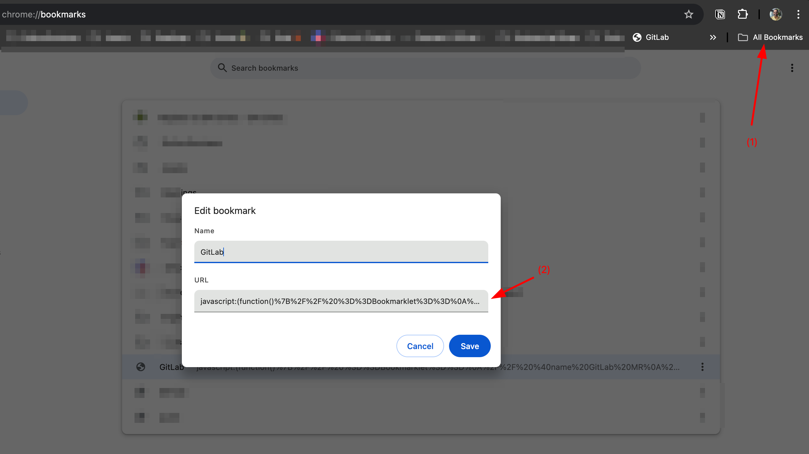

# Bookmarklets

A collection of bookmarklets for quick actions like PR links (GitHub, GitLab, etc.), Google docs, Notion, etc. These can be added to your browser bookmarks for easy access.

## Available Bookmarklets

- [GitLab MR](./bookmarklets/gitlab_merge_request)
- [GitHub PR](./bookmarklets/github_pull_request)
- [Quick Links](./bookmarklets/quick_links)

## How to Add a Bookmarklet to Your Browser

1. Copy the JavaScript code from the bookmarklet you want to use.
2. Open https://caiorss.github.io/bookmarklet-maker/, paste the code, click "Generate Bookmarklet", and copy the output.
3. Right-click on your bookmarks bar and select "Add Page" or "Add Bookmark."
4. Name the bookmarklet (e.g., "GitLab MR").
5. Paste the output code into the URL field.
6. Save the bookmarklet.
7. Click the bookmarklet while viewing a page (e.g., a GitLab MR) to call the embedded code.

### Visual Steps
Steps [1-2]

Steps[3-6]

Step[7]

